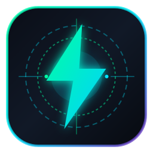
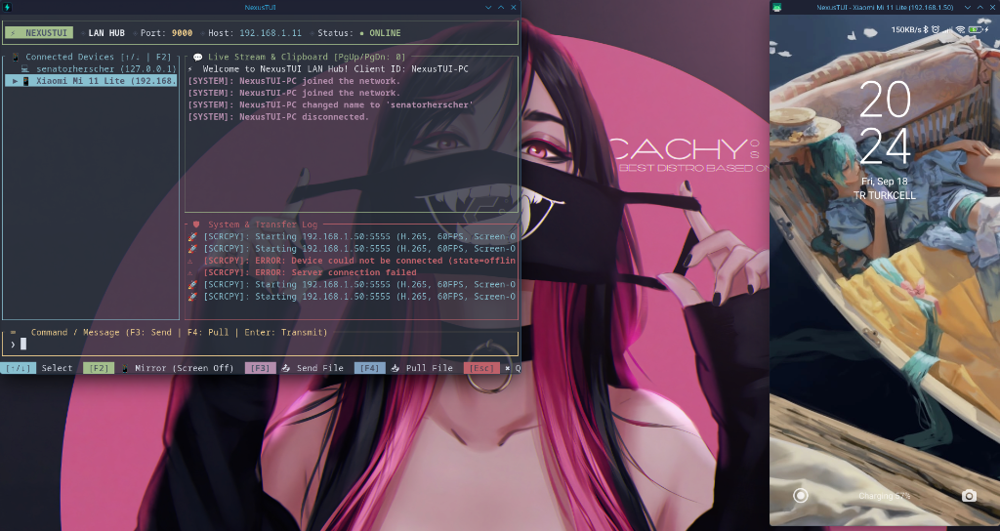
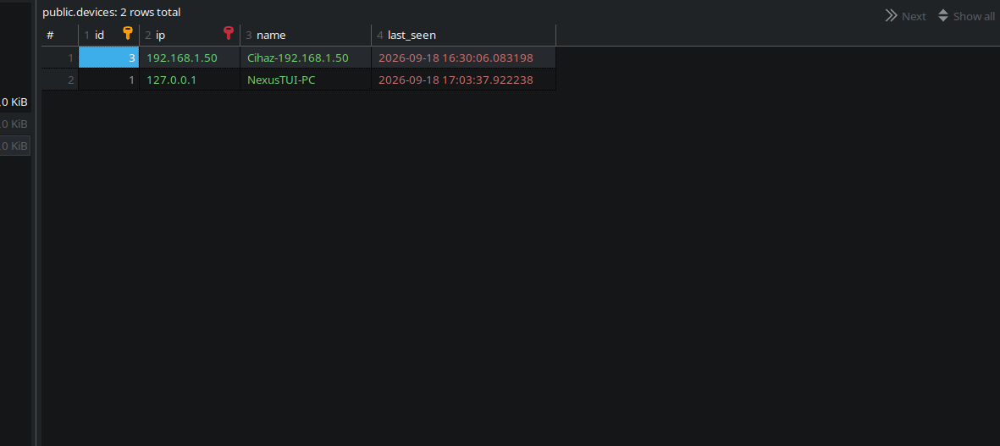
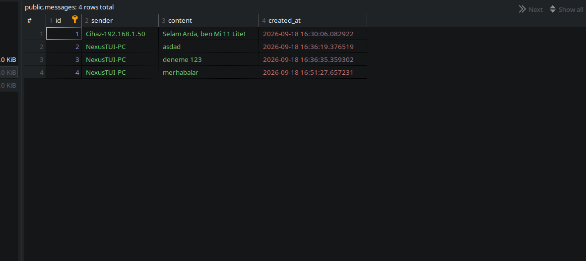

<div align="center">



# ⚡ NexusTUI

**Zero-GUI Footprint // Terminal-Native LAN Hub // 60 FPS Wireless Mirroring // ACID Storage**

[](https://github.com/SenatorHerrscher/NEXUSTUI/stargazers)
[](https://opensource.org/licenses/MIT)
[](https://www.rust-lang.org/)
[](https://go.dev/)
[](https://ratatui.rs/)
[](https://www.postgresql.org/)
[](https://www.docker.com/)
[](https://cachyos.org/)

<br />



*NexusTUI running on Linux CachyOS (Wayland) alongside a low-latency 60 FPS H.265 wireless mirror of a Xiaomi Mi 11 Lite with physical screen powered off.*

</div>

---

## 💡 Why NexusTUI?

Mainstream cross-device suites like **KDE Connect** and **GSConnect** were built for monolithic desktop environments. For users of tiling window managers (**Hyprland**, **Sway**, **i3**) and lightweight Linux distributions, they present substantial bloat:

* ❌ **Resource Hungry:** 150–250 MB RAM footprint tied to Qt/C++ background service daemons.
* ❌ **Mobile Bloat:** Require installing a ~50 MB APK on your phone that constantly runs battery-draining background services.
* ❌ **No Screen Off Mirroring:** Incapable of streaming 60 FPS hardware video without keeping the physical phone display blazing hot.
* ❌ **Volatile Sockets:** Session history and clipboard sync vanish when processes restart.

### The NexusTUI Paradigm:

* ✅ **Zero Mobile APK:** No third-party apps on Android. Operates entirely over native ADB Wi-Fi and Android's internal Linux toolchain.
* ✅ **< 15 MB Total RAM:** Go TCP Socket Hub (~8 MB) + Rust TUI Client (~6 MB).
* ✅ **Battery Saver Mirroring (`-S`):** Turns the physical phone display **completely off** during mirroring while keeping the stream active on your monitor and routing all audio to your PC speakers.
* ✅ **ACID Persistence:** Every message, clipboard sync, and device registration is persisted into **PostgreSQL** via high-performance connection pooling (`pgxpool`).
* ✅ **Zero Subprocess Bleed:** All background command streams (`adb`, `scrcpy`) are piped to a dedicated, isolated diagnostics viewport to eliminate terminal screen flicker.

---

## 📊 Benchmark Comparison

| Metric | ⚡ NexusTUI | 📱 KDE Connect / GSConnect | 🔌 Scrcpy (Standalone CLI) |
| :--- | :---: | :---: | :---: |
| **PC Memory Footprint** | **~14 MB** | ~180 MB (Qt / DBus) | N/A (Script only) |
| **Android APK Installed** | **0 MB (None)** | ~50 MB Background Service | None |
| **Screen Mirroring** | **H.265 60 FPS (Hardware)** | None / Experimental 30 FPS | Manual Terminal Commands |
| **Battery Saver Screen-Off** | **Automatic (`-S`)** | ❌ No | Flag required each run |
| **Direct PC Audio Routing** | **Automatic (Low Latency Opus)**| Manual PipeWire loopback | Flag required each run |
| **Interactive File Picker** | **Modal Dialogs (`F3` / `F4`)** | File manager notification | Manual path typing |
| **Gallery Auto-Indexing** | **Automatic (`MEDIA_SCANNER`)**| Manual reboot / rescan | ❌ No |
| **ACID History & Sync** | **PostgreSQL 16 (`pgxpool`)** | SQLite / Memory | ❌ No |

---

## 🏗️ Architecture

```text
               ┌──────────────────────────────────────────────┐
               │        POSTGRESQL 16 (Docker Container)      │
               │  - devices & messages (ACID, pgx/v5 pgxpool) │
               └──────────────────────▲───────────────────────┘
                                      │
                         pgxpool.Pool │ (127.0.0.1:5432)
                                      ▼
┌─────────────────────────────────────────────────────────────┐
│                 GO CENTRAL SERVER (:9000)                   │
│  - High-Throughput Goroutine TCP Socket Hub                 │
│  - Non-blocking Broadcast & Async Database Persistence      │
└──────────────▲──────────────────────▲─────────────────────▲─┘
               │                      │                     │
      TCP      │             TCP      │            TCP      │
┌──────────────▼──────┐ ┌─────────────▼───────┐ ┌───────────▼───────────┐
│     RUST TUI        │ │ ANDROID / XIAOMI    │ │   TABLET / 2ND PC     │
│ (PC Terminal Panel) │ │ (192.168.1.50)      │ │ (nc / Raw Socket)     │
│ - Ratatui Dashboard │ └─────────────────────┘ └───────────────────────┘
│ - [↑/↓] Select Dev  │            │
│ - [F2] 60FPS Mirror │◄───────────┘
│ - [F3] Quick Send   │  Wireless ADB (:5555) H.265 60 FPS Video Stream
│ - [F4] Pull to PC   │  + Screen-Off Battery Saver + Direct PC Audio
└─────────────────────┘
```

---

## ✨ Key Features

### 🚀 1. 60 FPS Wireless Mirroring with Screen-Off & Audio Routing (`F2`)
* **Physical Screen Power-Off:** Leveraging `scrcpy 4.1` with `--turn-screen-off` (`-S`) and `--stay-awake`. The phone's AMOLED screen remains pitch black while mirroring to your desktop, preventing OLED burn-in, overheating, and heavy battery discharge.
* **Low Latency Audio Forwarding:** All audio output is routed straight to your Linux desktop (PipeWire / PulseAudio via SDL2) with a 50ms buffer, while the device speaker is silenced.
* **Hardware H.265 Codec:** Encoded with the phone's native GPU encoder at 12 Mbps and a 30ms jitter buffer for seamless 60 FPS fluid playback.

### 📁 2. Keyboard-Driven Modal File Transfer (`F3` & `F4`)
* **Quick Send (`F3`):** Press `F3` to trigger a centered modal file picker. Press `[1-4]` to select a directory (`Downloads`, `Pictures`, `Documents`, `Desktop`), then press `[1-9]` to beam the file immediately to the phone over Wi-Fi.
* **Instant Android Gallery Indexing:** Photos and videos sent to `/sdcard/Download/NexusTUI/` trigger a broadcast intent (`android.intent.action.MEDIA_SCANNER_SCAN_FILE`), making them appear instantly inside the phone's native Gallery app under the **NexusTUI** album.
* **Pull Files (`F4`):** Lists the most recent files from the phone's download directory and downloads them directly into `~/Downloads/` on your PC with a single keystroke `[1-8]`.

### 🐘 3. PostgreSQL ACID Storage
All connection events, clipboard synchronizations (`/clip`), and messages are recorded in PostgreSQL:

<div align="center">

| Registered Devices (`public.devices`) | Message & Clipboard History (`public.messages`) |
| :---: | :---: |
|  |  |

</div>

---

## ⌨️ Hotkey Cheatsheet

| Key | Mode | Description |
| :--- | :--- | :--- |
| **`↑` / `↓`** | Navigation | Move selection indicator (`▶`) between connected devices |
| **`F2`** | Action | Launch 60 FPS H.265 wireless mirror with phone screen **OFF** & PC audio |
| **`F3`** | Modal | Open Quick File Sender popup (`[1-4]` folder, `[1-9]` file) |
| **`F4`** | Modal | Open Pull File popup (`[1-8]` download file to PC `~/Downloads/`) |
| **`PgUp` / `PgDn`**| Navigation | Scroll live message feed and clipboard history |
| **`Enter`** | Transmit | Broadcast message & trigger audible Android push notification |
| **`Esc`** | Action | Close active modal dialog or cleanly terminate NexusTUI |

---

## 🚀 Quick Start

### 1. Prerequisites
Ensure you have the following installed on your Linux machine:
```bash
# Arch / CachyOS
sudo pacman -S rust go docker docker-compose scrcpy android-tools
```

### 2. Clone Repository
```bash
git clone https://github.com/SenatorHerrscher/NEXUSTUI.git
cd NEXUSTUI
```

### 3. Start Database Backend
```bash
docker compose up -d
```

### 4. Connect Your Android Device Over Wi-Fi
1. Enable **Developer Options** & **USB Debugging** on your phone.
2. Connect phone via USB cable once and enable wireless ADB:
   ```bash
   adb tcpip 5555
   ```
3. Disconnect the USB cable and connect over Wi-Fi (replace with your phone's IP):
   ```bash
   adb connect 192.168.1.50:5555
   ```

### 5. Launch NexusTUI
```bash
cargo run --release
```
*The Rust client automatically detects if the Go backend server is running and starts it in the background if necessary.*

---

## 🖥️ Desktop Application Installation (KDE Plasma / Application Menu)

To install NexusTUI as a standalone desktop application with an app icon in your KDE Kickoff / Rofi / search menu:

```bash
./install.sh
```

This automatically:
* Compiles the optimized release binary to `~/.local/bin/nexustui`.
* Installs the high-resolution vector SVG and PNG cyberpunk icons to `~/.local/share/icons/hicolor/`.
* Registers `nexustui.desktop` in `~/.local/share/applications/` and updates the desktop database.
* Configures a dedicated window launcher that auto-starts the backend and opens NexusTUI without requiring a terminal shell prompt.

You can now search for **NexusTUI** with `Super`, launch it from your application menu, or pin it to your taskbar!

---

## 🛠️ Project Structure

```text
NEXUSTUI/
├── assets/                 # Showcase screenshots & demo media
│   ├── demo.png
│   ├── db_devices.png
│   └── db_messages.png
├── docker-compose.yaml     # Production PostgreSQL 16 & Server container stack
├── Cargo.toml              # Root Cargo Workspace manifest
├── LICENSE                 # MIT License
├── README.md               # Documentation & specifications
├── server/                 # Go TCP Hub Backend (:9000)
│   ├── Database/           # pgx/v5 connection pooling, schema migrations & queries
│   ├── Handler/            # TCP connection loop, command parsing (/nick, /clip)
│   ├── Hub/                # Thread-safe client manager & broadcast channels
│   ├── Dockerfile          # Multi-stage Alpine container build
│   └── main.go             # Backend entrypoint
└── tui/                    # Rust TUI Client (Ratatui 0.29 + Crossterm 0.28)
    ├── Cargo.toml
    └── src/
        ├── main.rs         # Event loops, ADB subprocess orchestration, auto-launcher
        ├── net.rs          # Non-blocking TCP socket reader thread
        └── ui.rs           # Cyberpunk HUD layout, modals, and styling
```

---

## 📄 License

This project is licensed under the MIT License - see the [LICENSE](LICENSE) file for details.  
Copyright © 2026 **Arda Serbest ([@SenatorHerrscher](https://github.com/SenatorHerrscher))**.
